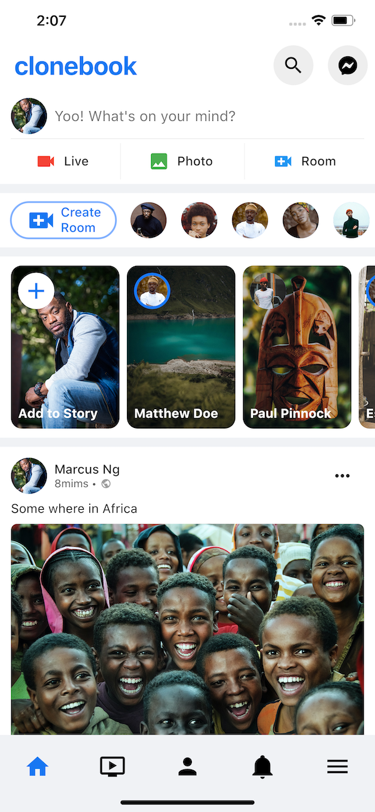

# Flutter Facebook Clone: 'Clonebook'.

[Twitter 🐦](https://twitter.com/mallenkb)

[Dribbble 🎨](https://dribbble.com/mallenkb)

[Github 👨🏾‍💻](https://github.com/mallenkb)

# Clonebook Screenshot
 
